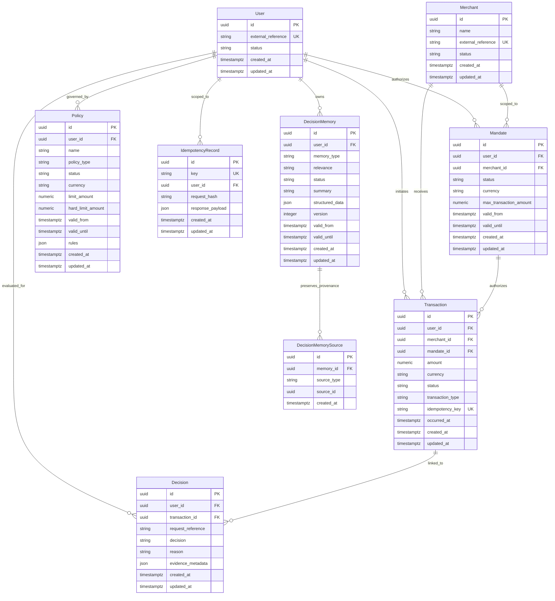
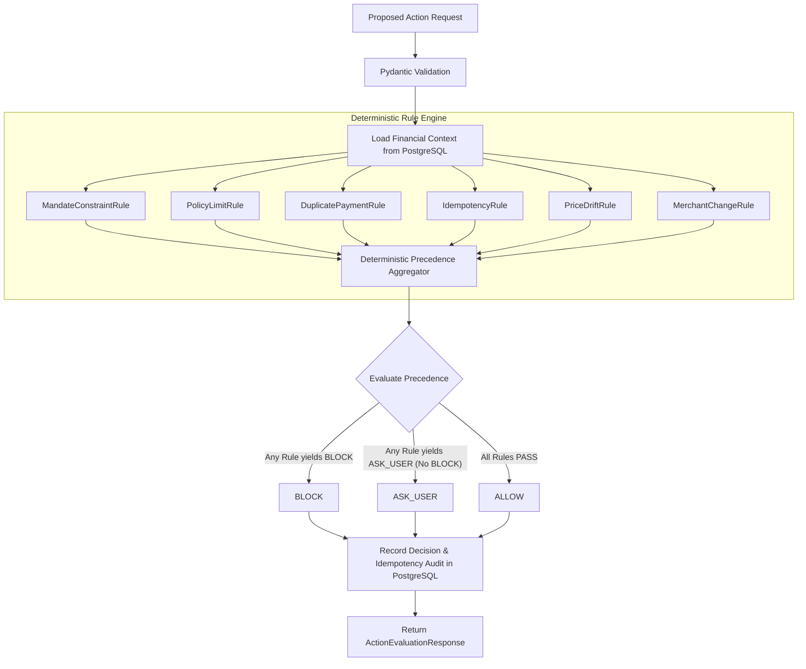

# DecisionVault System Architecture

DecisionVault is a decision-preserving financial memory system and deterministic security gateway designed to sit between autonomous AI buying agents and payment/mandate execution infrastructure (such as Razorpay test-mode integration in later phases).

---

## 1. System Philosophy & Core Mandate

The fundamental question DecisionVault answers before any financial authorization is:
> **"Given what happened in the past, should the agent exercise its existing payment authorization now?"**

### Core Invariant
> **"PostgreSQL is the source of truth. Decision memory is a derived representation and must never become the sole source of financial truth."**

Raw transaction history, mandate limits, and audit logs must never depend on vector memory, semantic indexes, or LLM reasoning for correctness. LLMs must never directly control payment authorizations.

---

## 2. Architecture Evolution

### Day 1: Engineering Foundation

```
[ User / Developer / Test Probe ]
                │
                ▼ HTTP / JSON
┌────────────────────────────────────────────────────────┐
│                   FastAPI Application                  │
│  - Configuration Management (pydantic-settings)        │
│  - Structured Logging & Sensitive Data Masking         │
│  - Global Error Handling (no stack trace leaks)        │
│  - Health Probes (/health, /api/v1/health)             │
│  - SQLAlchemy 2.0 Async Session Management             │
└────────────────────────────────────────────────────────┘
                │
                ▼ asyncpg / SQL
┌────────────────────────────────────────────────────────┐
│               PostgreSQL Database (Source of Truth)    │
│  - Schema Migrations (Alembic)                         │
│  - Baseline System & Audit Metadata                    │
└────────────────────────────────────────────────────────┘
```

### Day 2: Financial Domain Model



---

## 3. Day 3 & Day 4: Deterministic Guardrails & Safety Pipeline

DecisionVault evaluates proposed financial actions through an authoritative, deterministic rule engine before any money can move.



### Deterministic Rules Summary

| Rule ID | Rule Class | Category | Precedence Effect | Description |
| :--- | :--- | :--- | :--- | :--- |
| `MANDATE_CONSTRAINT_GUARD` | `MandateConstraintRule` | Hard Safety | `BLOCK` | Validates mandate ownership, active status, date range, currency, merchant scope, and single-tx cap. |
| `POLICY_LIMIT_GUARD` | `PolicyLimitRule` | Hard Safety | `BLOCK` | Enforces active user transaction limits and budget caps with exact decimal precision. |
| `DUPLICATE_PAYMENT_GUARD` | `DuplicatePaymentRule` | Hard Safety | `BLOCK` | Detects identical transactions (user, merchant, amount, currency, type) within sliding window (`300s`). |
| `IDEMPOTENCY_GUARD` | `IdempotencyRule` | Hard Safety | `BLOCK` (Conflict) / Replay | Validates canonical SHA-256 fingerprint; replays matching retries; rejects tampered keys. |
| `PRICE_DRIFT_GUARD` | `PriceDriftRule` | Contextual Signal | `ASK_USER` | Calculates median baseline from historical transactions; flags increases exceeding threshold (`25.0%`). |
| `MERCHANT_CHANGE_GUARD` | `MerchantChangeRule` | Contextual Signal | `ASK_USER` | Identifies shifts to unfamiliar merchants for users with established transaction histories. |

---

## 4. Day 5: Financial Memory Layer Foundation

Day 5 establishes the **Decision-Preserving Financial Memory Layer**, building structured, provenance-backed memory derived from raw PostgreSQL transaction history.

```text
                 RAW FINANCIAL HISTORY
                         │
                         │ PostgreSQL (Authoritative Source of Truth)
                         ▼
                CANONICAL FINANCIAL EVENT
                         │
                         │ Normalization & Exact Decimal Representation
                         ▼
              DECISION RELEVANCE CLASSIFIER
                         │
                         │ Explicit Deterministic Rules (Safety Override)
                         ▼
                  DECISION MEMORY
                         │
                  ┌──────┴──────┐
                  ▼             ▼
             PROVENANCE      RETRIEVAL
         (DecisionMemorySource) (User-Scoped & Bounded)
```

---

## 5. Day 6: Decision Evaluation with DecisionMemory Context

Day 6 integrates `DecisionMemory` directly into the `DecisionEvaluationService` execution pipeline.

```text
REQUEST (Proposed Financial Action)
   │
   ▼
VALIDATE REQUEST & IDEMPOTENCY
   │
   ▼
RETRIEVE USER-SCOPED DECISION MEMORY
   ├── Scoped to authenticated user_id
   ├── Filter status = ACTIVE
   ├── Filter temporal validity in SQL (valid_from <= now AND valid_until >= now)
   ├── Ordered by relevance (CRITICAL > HIGH > NORMAL > LOW) then recency
   └── Bounded by MEMORY_CONTEXT_LIMIT (default 10)
   │
   ▼
BUILD ENRICHED EVALUATION CONTEXT
   ├── User & Merchant & Mandate state
   ├── Active Policies
   ├── Recent Window Transactions
   ├── Merchant Price History & User Merchant IDs
   └── DecisionMemoryContext (Structured historical context)
   │
   ▼
RUN DETERMINISTIC GUARDRAILS
   ├── MandateConstraintRule
   ├── PolicyLimitRule
   ├── DuplicatePaymentRule
   ├── IdempotencyRule
   ├── PriceDriftRule
   └── MerchantChangeRule
   │
   ▼
APPLY DETERMINISTIC PRECEDENCE
   └── BLOCK > ASK_USER > ALLOW
   │
   ▼
AUDIT & RECORD DECISION CONTEXT
   ├── Persist Decision record with memory_context in evidence_metadata
   ├── Persist IdempotencyRecord
   └── Return ActionEvaluationResponse (with memory_context trace)
```

### Core Invariants & Policy Design
> **"Decision memory provides historical context but does not possess payment authorization authority."**
- A memory indicating routine purchases **cannot override** a hard policy cap or mandate constraint.
- A memory **cannot independently authorize** an `ALLOW` outcome.
- Memory retrieval failures fall back gracefully to empty context without bypassing safety rules or leaking stack traces.

### Two-Tier Policy Limit Enforcement
`PolicyLimitRule` operates across two tiers:
1. **Hard Ceiling (`hard_limit_amount`)**: Unconditional `BLOCK` (`POLICY_HARD_LIMIT_EXCEEDED`) if amount exceeds hard ceiling, regardless of history.
2. **Soft Limit (`limit_amount`)**: Routine spend threshold. If exceeded:
   - If the merchant has established historical price baseline consistent with the requested amount $\rightarrow$ downgraded to `ASK_USER` (`POLICY_SOFT_LIMIT_EXCEEDED`).
   - If the merchant is unverified or lacks justifying history $\rightarrow$ fails closed with `BLOCK` (`POLICY_LIMIT_EXCEEDED`).

---

## 6. Day 7: Semantic Memory & pgvector Retrieval Layer

Day 7 introduces DecisionVault's **first semantic retrieval capability**, adding vector similarity as a candidate-generation mechanism alongside existing deterministic retrieval without sacrificing determinism or safety.

```text
                 RAW FINANCIAL HISTORY
                         │
                         │ PostgreSQL (Authoritative Source of Truth)
                         ▼
                CANONICAL FINANCIAL EVENT
                         │
                         │ Normalization & Exact Decimal Representation
                         ▼
              DECISION RELEVANCE CLASSIFIER
                         │
                         │ Deterministic Context Rules
                         ▼
                  DECISION MEMORY
                         │
         ┌───────────────┴───────────────┐
         ▼                               ▼
STRUCTURED METADATA              CANONICAL TEXT
(Type, Relevance, Metrics)       (Reproducible text representation)
         │                               │
         │                               ▼
         │                      EMBEDDING PROVIDER
         │                      (Normalized Vector 384d)
         │                               │
         └───────────────┬───────────────┘
                         ▼
                 PERSISTENCE LAYER
               (PostgreSQL + pgvector)
                         │
                         ▼
             SEMANTIC CANDIDATE SEARCH
          (POST /api/v1/memories/search)
                         │
                         ├── Filter user_id (Tenant Isolation)
                         ├── Filter status = ACTIVE
                         ├── Filter temporal bounds (valid_from / valid_until)
                         ├── Cosine similarity threshold
                         └── Bounded result limit
                         │
                         ▼
             STRUCTURED MEMORY CONTEXT
                         │
                         ▼
             DETERMINISTIC GUARDRAILS
          (Mandate, Policy, Duplicate, Idempotency)
                         │
                         ▼
              ALLOW / ASK_USER / BLOCK
```

### Key Architectural Invariants for Semantic Memory
1. **Similarity ≠ Authorization**: High vector cosine similarity with past transactions provides historical context, but possesses **zero** financial authorization authority.
2. **Deterministic Guardrails Remain Authoritative**: Semantic similarity can never turn `BLOCK` into `ALLOW` (e.g. for policy limits, mandate mismatches, duplicates, or idempotency conflicts).
3. **Strict Tenant Isolation**: Vector searches are strictly bounded by `user_id` in SQL before similarity ranking. A highly similar memory from User B can **never** be retrieved by User A.
4. **Graceful Fallback**: If embedding generation fails, the memory is still created and stored with `embedding = None`. Financial safety evaluations and structured retrieval remain completely operational.

---

## 7. Day 8: Hybrid Memory Retrieval Layer

Day 8 introduces DecisionVault's **Hybrid Memory Retrieval Layer**, uniting deterministic financial relevance filtering with semantic vector ranking into a single bounded, explainable candidate-retrieval pipeline.

```text
                  PROPOSED FINANCIAL REQUEST
                              │
                              ▼
           HYBRID MEMORY RETRIEVAL (Two-Stage Pipeline)
                              │
  ┌───────────────────────────┴───────────────────────────┐
  │ STAGE 1: DETERMINISTIC CANDIDATE FILTERING            │
  │ - Strict user_id tenant isolation at database level   │
  │ - Lifecycle status = ACTIVE (exclude RETIRED/SUPER)   │
  │ - Temporal validity bounds (valid_from <= now <= until)│
  │ - Historical lookback window (default 90 days)        │
  │ - Bounded candidate pool (max 100)                    │
  └───────────────────────────┬───────────────────────────┘
                              │
  ┌───────────────────────────┴───────────────────────────┐
  │ STAGE 2: SEMANTIC SIMILARITY & TIERED HYBRID RANKING   │
  │ - Cosine similarity calculation over candidate vectors │
  │ - Relevance precedence tiering:                       │
  │   Tier 1: CRITICAL (1) > HIGH (2) > NORMAL (3) > LOW (4)│
  │   Tier 2: Vector similarity score (within same tier)  │
  │   Tier 3: Recency (created_at DESC)                   │
  │ - Explainable composite hybrid_score                  │
  │ - Safe fallback on embedding provider failure         │
  └───────────────────────────┬───────────────────────────┘
                              │
                              ▼
                  HYBRID MEMORY CONTEXT
                              │
                              ▼
                DETERMINISTIC GUARDRAILS
       (Mandate, Policy, Duplicate, Idempotency)
                              │
                              ▼
                   ALLOW / ASK_USER / BLOCK
```

### Ranking Safety Invariant
- **Relevance Precedence Guarantee**: A safety-critical memory (`CRITICAL` or `HIGH`) will **never** be displaced or outranked by a `NORMAL` or `LOW` memory, even if the latter exhibits higher semantic similarity ($0.99$ vs $0.70$).
- **Deterministic Guardrails Remain Authoritative**: Hybrid candidate memory retrieval provides structured context to the evaluation engine, but **zero** financial authorization power. Hard guardrails strictly govern money movements.

---

## 8. Day 9: Deterministic Decision-Preserving Financial Memory Compression

Day 9 introduces the **Decision-Preserving Financial Memory Compression Layer** ([`app/services/memory/compression.py`](file:///d:/cherry/project/app/services/memory/compression.py)), which consolidates redundant historical transactions into compact, derived `DecisionMemory` structures while preserving full provenance and decision-critical financial context.

```text
               AUTHORITATIVE RAW TRANSACTIONS
             (Permanent PostgreSQL source of truth)
                              │
                              ▼
                  CANONICAL FINANCIAL EVENTS
                  (Normalized exact Decimal)
                              │
                              ▼
              DETERMINISTIC COMPATIBILITY CHECK
                              │
         ┌────────────────────┴────────────────────┐
         ▼                                         ▼
[ROUTINE CANDIDATE GROUPS]                [SAFETY-CRITICAL EVENTS]
(Same merchant, currency,                 (CRITICAL/HIGH relevance,
 tx_type=PURCHASE, status=CAPTURED)        failed txs, chargebacks, anomalies)
         │                                         │
         ▼                                         ▼
DETERMINISTIC AGGREGATION                 PRESERVED INDIVIDUALLY
(Count, total, min, max, avg)             (Never absorbed into routine)
         │                                         │
         └────────────────────┬────────────────────┘
                              ▼
                     DECISION MEMORIES
                  (Derived Representation)
                              │
                              ▼
                  DECISION MEMORY SOURCES
             (Explicit 1:N Provenance to Source IDs)
```

### Core Invariant: Derived State vs Authoritative History
> **"Compression changes derived memory representation, not authoritative financial history."**
- Raw `Transaction` rows in PostgreSQL are **never** mutated, truncated, or deleted when a compressed memory is created or superseded.
- Rebuilding memory from unchanged source history deterministically produces identical memory state and metrics.

### Deterministic Compatibility Criteria
Two or more transactions are merged into an aggregate memory **only** if:
1. Exact same `user_id` (strict tenant isolation).
2. Exact same `merchant_id`.
3. Exact same `currency`.
4. Exact same `transaction_type` (`PURCHASE`).
5. Exact same `status` (`CAPTURED`).
6. Routine relevance (`NORMAL` or `LOW`).

### Safety-Critical Event Preservation
Events with `CRITICAL` or `HIGH` relevance (e.g. `MANDATE_EVENT`, `ANOMALY_EVENT`, failed transactions, chargebacks, price spikes) are **never** absorbed into routine summaries. They are preserved as individual, dedicated `DecisionMemory` items.

### Idempotency & Provenance
- `DecisionMemorySource` records link each compressed memory to every underlying source transaction ID.
- Repeated compression runs against unchanged history are idempotent, reusing existing active memories without duplicating rows.

---

## 9. Day 10: Tamper-Evident Hash-Chained Audit Log

Day 10 introduces the **Tamper-Evident Hash-Chained Audit Log** ([`app/services/audit/service.py`](file:///d:/cherry/project/app/services/audit/service.py)), providing an append-oriented, cryptographically chained operational trail for all financial decision evaluations and memory lifecycle operations.

```text
       RAW SOURCE HISTORY (PostgreSQL Transactions)
                       │
                       ▼
         DECISION MEMORY (Derived Context)
                       │
                       ▼
       DETERMINISTIC FINANCIAL GUARDRAILS
                       │
                       ▼
         AUTHORITATIVE DECISION OUTCOME
            (ALLOW / ASK_USER / BLOCK)
                       │
                       ▼
    TAMPER-EVIDENT HASH-CHAINED AUDIT LOG
 (SHA-256 Chained Linear Operational History)
```

### Core Architecture & Invariants
1. **Append-Oriented Log**: Records are strictly added with monotonically increasing sequence numbers ($1, 2, 3, \ldots$).
2. **Deterministic Cryptographic Chaining**:
   $$\text{record\_hash}_N = \text{SHA256}(\text{canonical}(\text{seq}_N, \text{prev\_hash}_N, \text{user\_id}, \text{event\_type}, \text{entity}, \text{data}, \text{occurred\_at}))$$
   - For Genesis record ($N=1$): $\text{previous\_hash}_1 = \text{NULL}$.
   - For subsequent records ($N > 1$): $\text{previous\_hash}_N = \text{record\_hash}_{N-1}$.
3. **Tamper Evidence**: Any alteration to `event_data`, `event_type`, `entity_id`, `sequence_number`, `occurred_at`, or `previous_hash` immediately invalidates cryptographic verification of that record and all downstream records.
4. **Observational Only**: Audit logging records operational evidence; it has zero authorization power and cannot override deterministic financial guardrails.
5. **Permanence**: Raw `Transaction` rows remain completely untouched and independent of audit records.

---

## 10. Day 11: Decision-Preservation Evaluation Framework

Day 11 introduces the **Decision-Preservation Evaluation Framework** ([`app/services/evaluation/decision_preservation.py`](file:///d:/cherry/project/app/services/evaluation/decision_preservation.py)), establishing an empirical, reproducible methodology to evaluate whether compressed `DecisionMemory` preserves the decisions produced from complete raw financial history.

```text
                     EVALUATION SCENARIO
                              │
             ┌────────────────┴────────────────┐
             ▼                                 ▼
   [FULL RAW HISTORY PATH]          [COMPRESSED MEMORY PATH]
   (PostgreSQL Transactions)        (Derived DecisionMemory)
             │                                 │
             ▼                                 ▼
 DETERMINISTIC GUARDRAILS           DETERMINISTIC GUARDRAILS
             │                                 │
             ▼                                 ▼
        DECISION A                        DECISION B
             │                                 │
             └────────────────┬────────────────┘
                              ▼
               COMPARATIVE MISMATCH EVALUATOR
                              │
     ┌────────────────────────┼────────────────────────┐
     ▼                        ▼                        ▼
  [MATCH]               [FALSE_ALLOW]             [FALSE_BLOCK]
(A == B)             (Full BLOCK/ASK ->        (Full ALLOW ->
                      Comp ALLOW; CRITICAL)     Comp BLOCK)
```

### Core Research Principle
> **"The evaluation framework measures whether derived DecisionMemory preserves decisions relative to authoritative financial history; it does not make a claim that memory compression is inherently safe."**

### Comparative Architecture
1. **Full-History Baseline Evaluator (`FullHistoryBaselineEvaluator`)**: Derives decision outcome $A$ directly from authoritative raw transactions, policies, and mandates without using `DecisionMemory`, embeddings, or LLMs.
2. **Compressed-Memory Evaluator (`CompressedMemoryEvaluator`)**: Derives decision outcome $B$ using only active `DecisionMemory` context through the exact same deterministic guardrail rules.
3. **Mismatch Classification**:
   - `FALSE_ALLOW`: Full history demands `BLOCK` or `ASK_USER`, but compressed memory allows (Safety-Critical!).
   - `MISSED_BLOCK`: Full history demands `BLOCK`, but compressed memory produces `ASK_USER` (Safety-Critical!).
   - `FALSE_BLOCK`: Full history allows, but compressed memory blocks (Availability penalty).
   - `FALSE_ASK_USER`: Full history allows/blocks, but compressed memory requests confirmation.
   - `MISSED_ASK_USER`: Full history requests confirmation, but compressed memory blocks.
4. **Exact Empirical Metrics**:
   - $\text{preservation\_rate} = \frac{\text{matching\_decisions}}{\text{total\_scenarios}}$
   - $\text{safety\_critical\_preservation\_rate} = \frac{\text{safety\_critical\_matches}}{\text{safety\_critical\_cases}}$
   - $\text{compression\_ratio} = \frac{\text{source\_event\_count}}{\text{retained\_memory\_count}}$

---

## 11. Day 12: Adversarial & Boundary Decision-Preservation Evaluation Suite

Day 12 expands the evaluation subsystem to stress-test DecisionMemory against edge boundaries, adversarial counterparty attacks, redundancy stress, and critical event preservation.

### Evaluation Suite Dimensions
1. **Policy Limit Boundaries**:
   - Exactly at policy limit: amount == limit (`ALLOW` boundary)
   - Just below limit: amount == limit - $0.01 (`ALLOW`)
   - Just above limit: amount == limit + $0.01 (`BLOCK` hard constraint)
2. **Price Drift Boundaries** (Threshold = 25.0%, baseline = $25.0000):
   - Exactly at threshold: drift == +25.00% ($31.2500, `ALLOW`)
   - Just below threshold: drift == +24.00% ($31.0000, `ALLOW`)
   - Just above threshold: drift == +26.00% ($31.5000, `ASK_USER`)
3. **Merchant Identity & Counterparty Shifts**:
   - Familiar routine counterparty (`ALLOW`)
   - Unfamiliar changed counterparty (`ASK_USER`)
   - Secondary known counterparty (`ALLOW` / `ASK_USER`)
   - Similar merchant name with different UUID (strictly checks authoritative ID -> `ASK_USER`)
4. **Critical Event Recall Inside Redundant History**:
   - Evaluates whether safety-critical events (e.g. `FAILED` payments, chargebacks, anomalies) surrounded by redundant routine transactions maintain active memory representation.
   - Computes exact **Critical-Memory Recall**:
     $$\text{critical\_memory\_recall} = \frac{\text{critical\_relevant\_events\_preserved}}{\text{critical\_relevant\_events\_required}}$$
5. **Redundancy Stress**:
   - Compresses 10, 25, 50+ repeated routine events into aggregate summaries and verifies zero degradation in decision preservation.

---

## 12. Day 13: Synthetic Financial Dataset Infrastructure

Day 13 establishes the **Synthetic Financial Dataset Generation Layer** ([`experiments/synthetic/`](file:///d:/cherry/project/experiments/synthetic/)), providing a deterministic, seeded generator for creating controlled financial histories with explicit ground-truth annotations for routine versus decision-critical events.

```text
       [DatasetConfig] (seed, scale, scenario_mix, placement)
                                │
                                ▼
                   SyntheticDatasetGenerator
                                │
        ┌───────────────────────┼───────────────────────┐
        ▼                       ▼                       ▼
  [ROUTINE EVENTS]       [CRITICAL EVENTS]     [DATASET MANIFEST]
  - Purchases ($25.00)   - Price Spikes (+60%)  - seed, scales
  - Subscriptions ($15)  - Merchant Shifts      - scenario counts
  - Stable series        - Failed Payments      - critical vs routine
                         - Duplicate-like Pairs   event totals
                                │
                                ▼
                       SyntheticDataset
                                │
        ┌───────────────────────┴───────────────────────┐
        ▼                                               ▼
[JSON SERIALIZATION]                           [DATABASE SEEDING]
(Round-trip verified)                  (PostgreSQL / SQLite test tables)
                                                        │
                                                        ▼
                                              DecisionVault Pipeline
                                           (Compression -> Evaluation)
```

### Core Architecture & Invariants
1. **Bitwise Reproducibility**: Given identical seed and configuration, `SyntheticDatasetGenerator.generate(...)` generates identical UUIDs, timestamps, amounts, currencies, statuses, and scenario metadata.
2. **Explicit Ground-Truth Labeling**: Distinguishes `is_compression_candidate` (routine events) from `is_decision_critical` (failures, severe drift, merchant transition, duplicate pairs, policy breaches) without relying on heuristic inference.
3. **Strict Separation of Concerns**: Synthetic dataset logic resides entirely outside the `app/` production application core and has zero production runtime authority.
4. **Exact Monetary Precision**: Monetary values strictly utilize Python `Decimal` with 4-decimal precision without binary floating-point representation.
5. **Lossless JSON Round-Trip**: Persists full experiment configurations and records into portable JSON fixtures for Day 14 large-scale benchmarks.

---

## 13. Buildathon Complete: Razorpay Test Mode Payment Gate & Interactive Demo Dashboard

```
                  ┌─────────────────────────────────────┐
                  │          AI BUYING AGENT            │
                  └──────────────────┬──────────────────┘
                                     │ POST /api/v1/payments/execute
                                     ▼
                  ┌─────────────────────────────────────┐
                  │    DecisionVault Security Gate      │
                  │                                     │
                  │ 1. Retrieve Historical Memory       │
                  │ 2. Evaluate Deterministic Guardrails│
                  │ 3. Check Mandate & Policy Limits    │
                  │ 4. Detect Price Drift & Duplicates  │
                  └──────────────────┬──────────────────┘
                                     │
                 ┌───────────────────┼───────────────────┐
                 │                   │                   │
         [Outcome: ALLOW]    [Outcome: ASK_USER] [Outcome: BLOCK]
                 │                   │                   │
                 ▼                   ▼                   ▼
       ┌──────────────────┐  ┌──────────────┐  ┌──────────────────┐
       │   Razorpay Test  │  │ User Confirm │  │  Zero Money Mvt  │
       │   Mode Payment   │  │    Modal     │  │   403 Forbidden  │
       │   (Order/Pay ID) │  └───────┬──────┘  └────────┬─────────┘
       └────────┬─────────┘          │                  │
                │                    ▼ (if confirmed)   │
                │           ┌──────────────────┐        │
                │           │ Execute Payment  │        │
                │           └────────┬─────────┘        │
                │                    │                  │
                └────────────────────┼──────────────────┘
                                     │
                                     ▼
                ┌────────────────────────────────────────┐
                │   Tamper-Evident SHA-256 Audit Log     │
                │  (PAYMENT_REQUESTED, PAYMENT_ATTEMPTED,│
                │   PAYMENT_SUCCEEDED, PAYMENT_FAILED)   │
                └────────────────────────────────────────┘
```

### Core Components Implemented
1. **Razorpay Test Mode Integration (`PaymentExecutionService` & `RazorpayTestClient`)**:
   - Executes real official Razorpay Sandbox Orders via Basic Auth `(key_id, key_secret)`.
   - Converts monetary amounts to smallest currency subunits (paise: ₹150.00 -> 15000 paise).
   - Gracefully runs in local sandbox simulation mode when API keys are omitted.
2. **Deterministic Payment Gating**:
   - Zero funds debited if guardrails trigger `BLOCK` or pending `ASK_USER`.
   - Supports user decision confirmation via `POST /api/v1/payments/decisions/{id}/confirm`.
3. **Interactive Buildathon Demo Web Dashboard (`app/static/`)**:
   - Served directly by FastAPI at `/` and `/demo`.
   - Tab 1: **Decision & Payment Console** with live guardrail breakdown and Razorpay execution.
   - Tab 2: **Financial Memory View** with raw transaction provenance and compression triggers.
   - Tab 3: **Tamper-Evident Audit View** with live SHA-256 chain verification.
   - Tab 4: **Compression & Evaluation Benchmarks** (Standard & Adversarial suites).
   - Tab 5: **1-Click Canonical Demo Scenarios** (8 buildathon scenarios).


